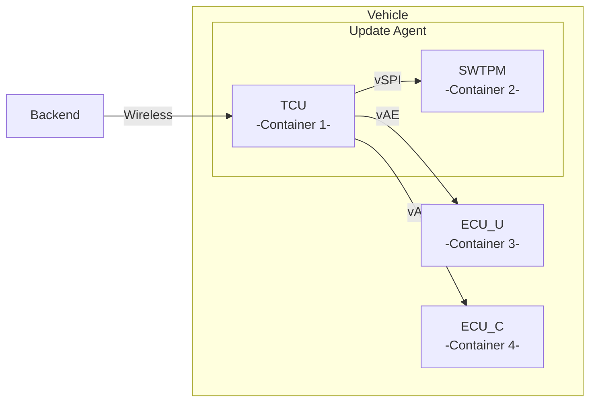

# Update Distribution

This project demonstrates how the TPM2.0 can be utilized as update agent in
automotive (OTA) update scenarios. It is used as a “cryptographic proxy”
(Security Building Block (SBB) 1) and update installation authorization
coordinator (SBB2). As “cryptographic proxy”, it translates the asymmetric
cryptography that is typically deployed in the vehicle environment to the
symmetric cryptography that is typically used in the restricted in-vehicle
network. As update installation authorization coordinator it authorizes the
update installation under particular conditions, e.g., to prevent downgrade
attacks or to enforce that the vehicle is in a safe state.

## Modules

To show this, we create a virtual automotive network and corresponding backend
server via Docker containers. The telematics control unit (TCU) is attached to
the TPM via a virtualized SPI bus (vSPI), while TCU, update target ECU
(ECU_U), and condition ECU (ECU_C) are connected via virtualized
(Automotive) Ethernet (vAE).



## General Container Setup and Management

To get the project working, [Docker Compose]
(https://docs.docker.com/compose/) needs to be installed. The docker compose
file defines all networking between the containers. These commands are the most
important:

```
1. docker compose -f docker-compose.yml build // build all the container images
2. docker compose -f docker-compose.yml up -d // start all containers and detach
3. docker compose -f docker-compose.yml down // stop and reset all containers
```

## TPM HW and Software Simulator

Per default, the project is compiled using a software TPM (SWTPM). However, if
available, also a hardware TPM can be used. To switch between both variants the
TCTI needs to be specified accordingly:

1. SWTPM: `char *tcti_name = "swtpm:host=10.0.0.20,port=2321"`
2. HWTPM: `char *tcti_name = "device:/dev/tpm0"`

## Usage

### Provision Backend

This script uses OpenSSL to create the asymmetric backend keys that are used to
sign the update bundles. Moreover, it creates and signs the update bundle,
creates the template hash (used as input for the SBB- and update-specific
symmetric key derivation), the derivation secret, and the condition ECU IDs. 

```
1. cd src
2. Create backend keys, update packages, and some auxiliary data
  - bash main-backend.sh allcmds rsa // "Export" raw.key `xxd keys/raw.key`
3. cd ..
```

### Build and start Docker containers for TCU (with attached SWTPM), ECU_U, and ECU_C

After the backend provisioning, TCU, update target ECU (ECU_U), and condition
ECU (ECU_C) are started as containers in our virtual automotive network.

```
1. docker compose -f docker-compose.yml build
2. docker compose -f docker-compose.yml up -d
```

### Execute SBB1

In this step, the SSB1 (Authenticated Update Distribution) will be executed. In
SBB1, the TPM is responsible for the secure transmission of the update bundle
from the backend in the vehicle environment to the update target ECU(ECU_U). In
this role, the TPM acts as “cryptographic proxy” that translates the asymmetric
cryptography that is typically deployed in the vehicle environment to the
symmetric cryptography that is typically used in the restricted in-vehicle
network.

#### On ECU_U (console window 1)

First, login into the Docker container of ECU_U and provision ECU_U with its
unique derivation secret. Then start ECU_U in listening mode to wait for
incoming update data.

```
docker exec -w /tmp/src -it update-distribution-ecuu /bin/bash
bash main-ecu-u.sh provision
bash main-ecu-u.sh sbb1
```

#### On TCU (console window 2)

Second, login into the Docker container of the TCU and provision the TCU with
its unique derivation secret, the revocation NV index, and the initial
authorization policy. Then, create the update policies RKP (Rekeying Policy)
and IAP (Installation Authorization Policy). Finally, start SBB1 by verifying
the update bundle and conditionally deriving the MAC key and rekeying the
update bundle, which is enforced inside the TPM by processing the RKP. After
successful rekeying, the TCU sends the update and MAC to ECU_U. 

```
docker exec -w /tmp/src -it update-distribution-tcu /bin/bash
bash main-tpm.sh provision
bash main-tpm.sh createpolicies
bash main-tpm.sh sbb1
```

#### On ECU_U (console window 1) 

ECU_U receives update bundle and MAC, derives the update- and SBB-dependent MAC
key and verifies the MAC. Upon successful verification (REKEYING SUCCESS),
update is securely (unmodified) distributed from the backend via TCU (TPM) to
ECU_U with our rekeying mechanism.

### Execute SBB2

In this step, the SSB2 (Coordinated Update Authorization) will be executed. In
SBB2, the TPM is responsible to coordinate the update installation after the
update has been securely distributed with SBB1. It authorizes the update
installation under particular conditions, e.g., to prevent downgrade attacks or
to enforce that the vehicle is in a safe state. These conditions are requested
from condition ECUs (ECU_C) in challenge-response schemes.


#### On ECU_C (console window 3)

First, login into the Docker container of ECU_C and provision ECU_C with its
unique derivation secret. Then start ECU_C in listening mode to wait for
incoming challenge data.

```
docker exec -w /tmp/src -it update-distribution-ecuc /bin/bash
bash main-ecu-c.sh provision
bash main-ecu-c.sh sbb2
```

#### On TCU (console window 2)

Second, also start the TCU in listening mode to wait for a challenge sent by
ECU_U.

```
bash main-tpm.sh sbb2
```

#### On ECU_U (console window 1)

Finally, on ECU_U, generate and send the challenge to TCU. Upon successful
answer by the TPM, ECU_U will install the previously received (and benign)
update bundle. TCU will receive the challenge and forward it to the TPM. To
successfully answer the challenge, the TPM needs to authorize specific key
derivation that is bound to a successful processing of IAP. IAP requires state
retrieval of the condition ECU ECU_C. ECU_C answers the challenge if it is in a
correct state, e.g., has enough remaining battery power, and the TPM verifies
the answer. Upon successful processing of IAP, TPM authorizes key derivation
and can then successfully answer the initial challenge of ECU_U. The update
authorization process is successful and ECU_U can install the update
(INSTALLATION SUCCESS).

```
bash main-ecu-u.sh sbb2
```
